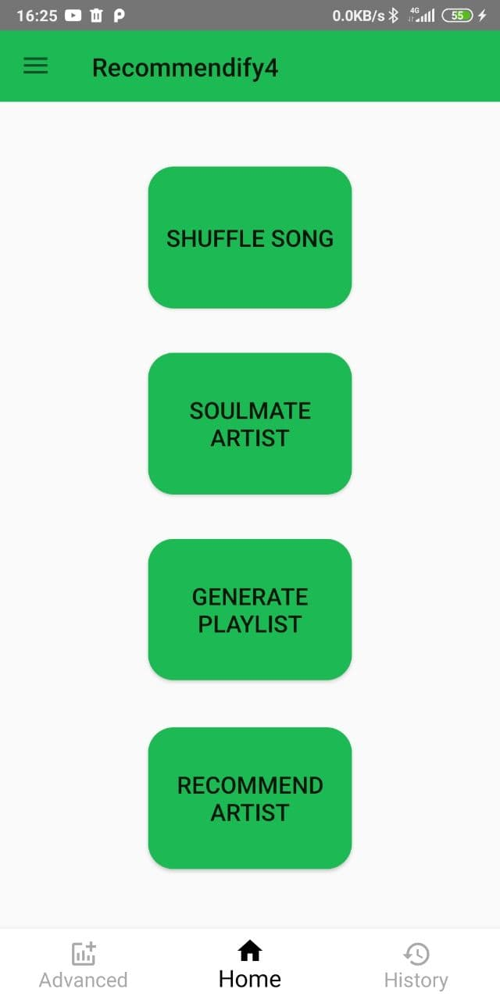
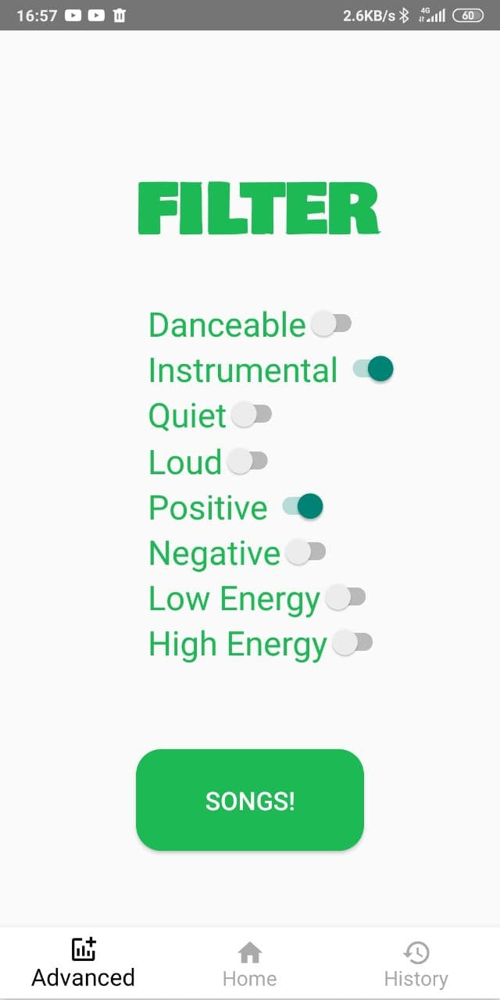
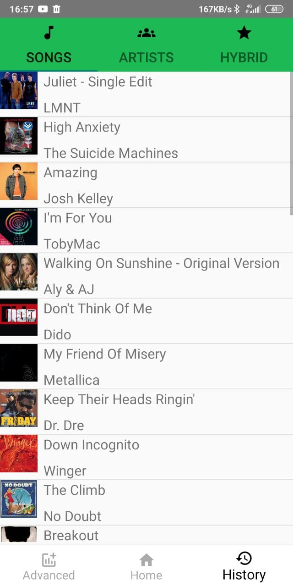
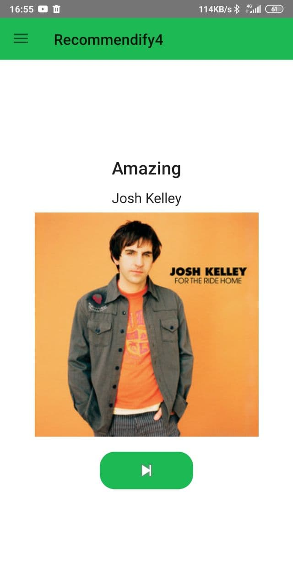

# Abstract
Our project consists of a music recommender. It builds a user profile in order to generate the recommendations, performing both content-based and collaborative filtering. To do this, the users will login with their Spotify credentials, then the data will be retrieved from the Web, their tastes will be profiled and then some specific algorithms will return songs from a dataset that he has not listened to and that may interest them.
Our project consists of a music recommender. It builds a user profile based in Spotify data in order to generate the recommendations, performing both content-based and collaborative filtering. To do this, the users will login with their Spotify credentials, then the data will be retrieved from the Web, their tastes will be profiled and then some specific algorithms will return songs from a dataset that he has not listened to and that may interest them.

# Authorization with Spotify API

First of all, register your app on the spotify developer page, which allows you to have a CLIENT_ID and a CLIENT_SECRET, as well as a callback to make API calls.
To authorize the user, we use the spotify SDK and the Authorization library, in addition to various API calls. At first we carry out the authorization with a temporary TOKEN provided by the library, but this token is only valid for one hour. To solve, we make a request with the SDK to request a code (instead of a token) and with this code we make a request to the spotify API, which returns an access token and, in addition, a refresh token with which We can renew the token once it expires.

# Spotify API Requests

Spotify API allows to access data of a user through all endpoints that it defines. Each request needed to get information from these endpoints and data it must contain are defined in API's documentation.

In our project, most of the information obtained from the API is done via these Http requests, that mostly serve to get all information required to build a profile for the user, but also to create a playlist with our recommendations, search for an artist and get and refresh tokens.

# User Profile

This is the object that our application uses to store all information needed to represent a user and on which it bases most of its functions. Each user is represented with its credentials (access token, refresh token and their expiration time), its user id, name and profile pic, and some data about music the user has been listening recently and historically in Spotify. 

More precisely, we are getting last 50 played and all time top songs and artists. This way, we base our recommendations in this data.

# Chaquopy (and the problems of running Python code in Android systems)

Since a very common language for doing recommending tasks and other Machine Learning (and also with a huge amount of information on the Web) tasks we decided that using Python would be key to our app. Another big reason is that we felt more familiar with this enviroment than programming all the intelligence in Java from scratch. We found Chaquopy, which is a Python SDK for Android. 

It promises:

"Chaquopy enables you to freely intermix Python, Java and Kotlin in any app, using whichever language is best for your needs:

With the Java API, a regular Java or Kotlin app can include Python components. Reuse your existing Python code on Android, or take advantage of PyPI packages including SciPy, OpenCV and TensorFlow.

With the Python API , you can write an app partly or entirely in Python. The complete Android API and user interface toolkit are directly at your disposal."

The problems came when dealing with very big amounts of data inside Android (we would run out of memory very quick and the app would stop pretty soon) so we had to find ways to compress all this data and stay only with the needed info (getting rid of unnecessary data from intermediate steps) and save the models instead of training them "on the go". 

One useful tool was to transform the values of the data frame into a SciPy sparse matrix (and save it for preloading), which turns out to be more efficient in memory and calculation terms.

Since using Chaquopy requires a license, we had to contact its developers in order to get the key (to prevent the app from closing 5 minutes after its start), they were very humble and helped us quickly.

# Content-based recommendations

From the Spotify Dataset we started trying to do the Content-Based algorithm, it provided features such as danceability, acousticness, valence, etc. Since we could only find sites that will explain content-based algorithms for things like movies and they weren't easily to apply, we had to think about which one would be the best option. First, we started trying to use clustering, which divided the songs into groups according to the features of the songs. This did not seem like the best approach, since the dataset has 160k songs and it divided the dataset into too large groups, besides more than 8 clusters it started to perform worse.

Then we looked for other options like k-means and k-neighbours. After evaluating it, we thought that k-neighbours would be the most suitable. K-neighbours allowed you to find the k closest neighbours to a song according to the features you wanted to assess. After trying many combinations and trying to weigh some features, many times it gave recommendations that did not make sense.

It was then when we realized that in the Spotify Dataset there were more datasets that had data for the genres of the songs. This allowed us to make much more precise predictions, we went on to take the decade of the song and check the similarities of the genres, in addition to the cosine similarity of the features, which provided much more precise recommendations.

# Collaborative-based (Item-based) recommendations

For the collaborative side of this recommender, we began trying to recommend songs using a dataset provided by the same source (the OneMillionSong dataset), we built with some tutorial's guiding and found that K-Neighbors was one of the most frequent approaches for this matter. The problem was that sticking only to popular songs (which is a common thing to do to get good recommendations in the beginning) the dataset was left with only 9500 songs (which is pretty poor and did not generate interesting or good recomendations).

Then we came up with the idea of recommending artists instead of songs (for this we found a pretty complete dataset made from Last.fm data). The Last.fm is from the Music Technology Group at the Universitat Pompeu Fabra in Barcelona, Spain. The data were scraped by Òscar Celma using the Last.fm API and they are available free of charge for non-commercial use. 

The Last.fm data are broken into two parts: the activity data and the profile data. The activity data comprises about 360,000 individual users' Last.fm artist listening information. It details how many times a Last.fm user played songs by various artists. The profile data contains each user’s country of residence. 

Given that we're going to be doing item-based collaborative filtering, our recommendations will be based on user patterns in listening to artists. Lesser known artists will have views from fewer viewers, making the pattern more noisy. This would probably result in bad recommendations (or at least ones highly sensitive to an individual person who loves one artist. To avoid this problem, we'll just look at the popular artists.

We decided to reduce this dataset considering only data from users in Spain, EEUU and UK which proved to give pretty consistent and logical recommendations, besides better performance than using the whole dataset (it was too big for hosting the whole intelligence in the Android system).

With this modifications to the original dataset we were able to generate recommendations among +7000 artists (which is not very big) but it is quite accurate. 

One problem of this dataset was that it was generated a few years ago and modern/recent artists are not contained in it (those are ignored in the recommendation process).

Then, for easy ID-to-artist-name mapping we built a king of “look-up” (codified in JSON format) table to translate in an easy way the artist IDs obtained from the recommendation process to Artist names.

Another drawback of this dataset is that it is not related in any way with the information that Spotify holds about the artists so we had to manage this by querying the Spotify API using the artist name as a key to get all the info that we need from the artist (this is based on the premise that the artist names are not probably repeated and the ones that are in the dataset are only popular artists, for efficiency reasons).

For the artist recommendation process we considered it was a good idea to continue using the k-NearestNeighbors algorithm (a very common and simple one for recommender systems of any kind). In this case (and unlike our first try with songs) it gave pretty consistent recommendations for most of us (specially for the ones who listen to more “mainstream” music). We did some validation of the model by listening to the bands that we didn’t know and it was pretty interesting and the recommendations.

# Hybrid Recommendations

Firstly, for the hybrid recommendations we started sorting by the coincidences between the artists recommended by the Collaborative and the Artists of the songs recommended by the Content-Based, but this had a "poor" performance, being the coincidences too infrequent. So we figure out a better way to do this, the solution that we came up with was to get the matches in the genres of the artist of the recommended songs by the Content-Based Recommendator and the genres of the artists of the Collaborative Recommendator, then we sort the songs recommended by the number of matches that each song got.

# Advanced Mode

It was time to move to advanced mode. Which was pretty easy using that dataset. According to the parameters of the songs, it allowed us to put different filters such as if the songs are live, only instrumental, if they are energetic, positive, negative, etc. We have some filters that allow us to activate any of these characteristics, the program filters the songs of the dataset by a certain value of the features such as liveness, speechiness, and the songs left are only those that pass the limitations. The songs that best match the filters entered are the recommendations.

# Playlist Creation

Our application gives users the possibility of creating a playlist in their spotify accounts with the songs that the application has recommended them, using the endpoints for creating a playlist and adding songs to it that the spotify api offers. 

Initially, what our system did first was asking users the name they wish to give to the playlist. After getting the name, it sent a request to the api to create the playlist and inmediately after getting the id of the just-created playlist, it sent other request to add all songs that was shown to the user. As we explain in the "Background processing" section, all http request must be done in the background, so we decided to use the launcher to send the 2 requests needed. 

Nevertheless, recently we chose to do this requests with the thread pool executor, as we consider appropiate to just use the launcher to get information without which the application will not work correctly (user profile). 

# Background processing

Initially, we thought it would be a good idea to do part of the information processing and recommendations in the background since we found out that this is a good Android programming practice. After searching on the subject, it seemed that WorkManager was the best option. WorkManager is an API that allows you to do asynchronous jobs in the background. For its implementation, a java Worker class is created, with a DoWork () method where the work that needs to be done is, in our case, collecting the data of the users' recommendations. From the activity where you want to do the background work, a Worker object is invoked and this method is called. In principle, it should only return its status (failure or success) but it allows the return of a Data type, which is useful to us since it is what allows us to collect the recommendations.

In a more advanced stage of project development, while integrating all related with the user profile building, we found out that it was an Android requirement to do some kind of stuff (like Http request sending) in the background, so the main thread that handles the interface of the application doesn't get blocked. After some research, we decided to use threads instead of work managers for the background processing, because we knew how to make some improvements in efficiency using them. 

In result, our background processing is now handled launching threads in two ways, through a ThreadPoolExecutor or throught the class "Thread Launcher". Main thread uses the executor to generate the recommendations in the background (in an asynchronous way) and the launcher to build the user profile (in a synchronous way).

# Work Flow.

+ The user identifies himself with his spotify account through the gateway provided by the spotify SDK. This request returns code with which we request a token from spotify through its API. This token has associated a series of scopes that allow us to make various requests to the API (e.g user-read-recently-played allows us to obtain the songs that the user recently listened to).
+ We create the user profile as indicated in the "User Profile" section.
+ With this information we make different recommendations as indicated above in the project explanation through different threads.
+ The last step that the application performs is the representation of the recommendations for the user.
	+ Our application has 4 activities:  
        	1. Login: allows you to log in with your spotify account. 
	        2. Main: where the main functions of the application are found, such as Shuffle song or Soulmate artists. 
        	3. Advance: allows you to search for songs based on certain parameters such as acousticity or instrumentality. 
        	4. History: this activity shows the songs and artists that were presented to the user. 
	+ To show the songs and artists we use Android fragments, which provide a mechanism to quickly change the screen and create a graph of them. For example, to present the songs to the user we use the fragment FragmentSong that presents us with a layout with the information of the song and plays a small sample of it.

## Some Captures.

